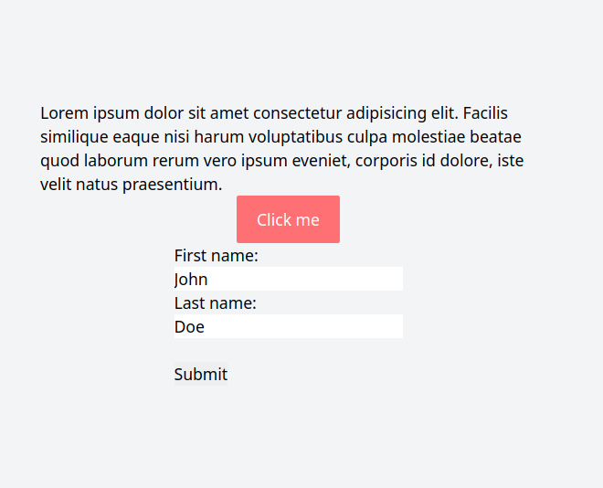
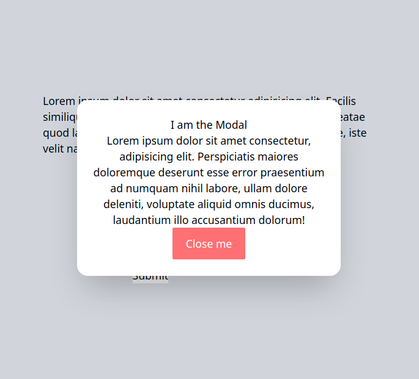

<br/> 

# Pop up Modal
<hr />


<table>
  <tr>
    <td></td>
     </tr>

  <tr>
    <td> </td>
  </tr>
 </table>
<hr /><br/> <br/>

*  Implementation of Modal Pop up 

```
HTML, TailWindCSS, JS
````
<hr />


## Demo

## <a class href="https://modalcard.netlify.app" target="_blank" >See Live</a>

